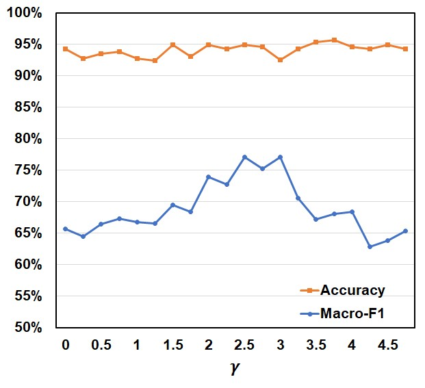
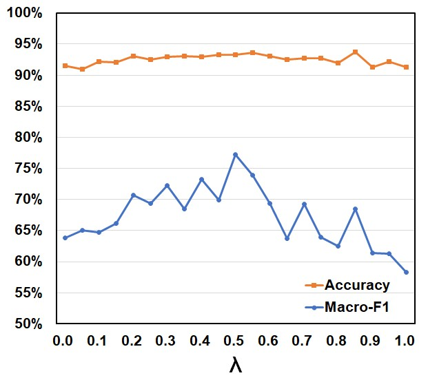
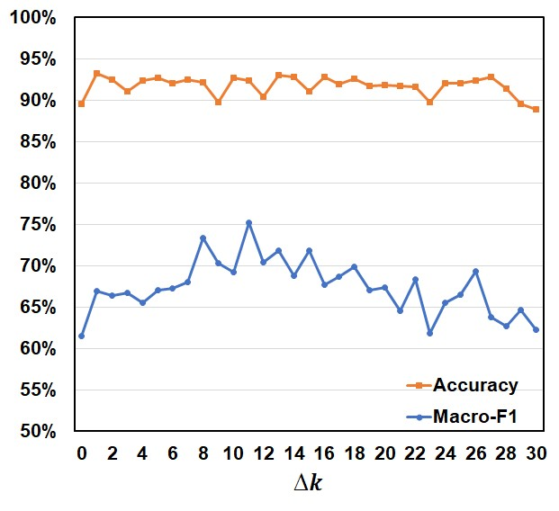

# SF-DynFinGC
SF-DynFinGC: Learning Scale-Free Dynamic Graphs for Financial Anomaly Detection

Financial anomaly detection (FAD) is a critical task for economic security. Graph-based methods for FAD are promising, but their effectiveness is determined by graph construction, a critical yet overlooked foundation. However, the reliance on either static or overly simplistic dynamic models renders current construction strategies inadequate. These strategies are often computationally expensive and incapable of modeling complex spatio-temporal relationships. To overcome these challenges, we propose Scale-Free Dynamic Financial Graph Construction (SF-DynFinGC). The framework integrates scale-free structural regularization with a decay-governed global Top-k edge selection strategy to construct sparse, interpretable graphs that highlight critical relationships indicative of anomalies. Experiments demonstrate that SF-DynFinGC consistently outperforms existing methods on multiple benchmarks. Visualization analysis further confirms the framework's ability to capture hierarchical and dispersed characteristics of real-world financial networks. This work establishes a robust foundation for domain-aware spatio-temporal graph learning, advancing its application in financial risk management. The code and datasets are available at: https://github.com/AnguoCYF/SF-DynFinGC

# Supplementary Experimental Results for SF-DynFinGC

This document provides the complete, unabridged experimental results for our paper, "SF-DynFinGC: Learning Scale-Free Dynamic Graphs for Financial Anomaly Detection." Due to the strict page limits of the conference format, the main paper primarily presents results using the GCN backbone. The tables below include additional results with GAT, GIN, and Graphormer backbones to offer a more comprehensive evaluation and demonstrate the robustness of our proposed method.

## Full Benchmark Results

The following table presents the performance (Accuracy and Macro-F1 Score) of traditional ML models and various graph construction methods across three FAD datasets. Our method, **SF-DynFinGC**, is compared against baselines when paired with four different GNN backbones: GCN, GAT, GIN, and Graphormer.

| Classifier  | Graph Construction | Airbnb Acc. | Airbnb F1 | AML Bank Acc. | AML Bank F1 | S. German Acc. | S. German F1 |
| :---------- | :----------------- | :---------- | :-------- | :------------ | :---------- | :------------- | :----------- |
| SVM         | None               | 0.862       | 0.748     | **0.957** | 0.489       | 0.800          | 0.444        |
| MLP         | None               | 0.844       | 0.762     | 0.950         | 0.669       | 0.730          | 0.522        |
| Decision Tree| None               | 0.794       | 0.698     | 0.921         | 0.556       | 0.790          | 0.521        |
| Random Forest| None               | 0.837       | 0.734     | 0.935         | 0.574       | 0.780          | 0.601        |
| LR          | None               | 0.868       | 0.773     | 0.950         | 0.598       | 0.759          | 0.486        |
| LR          | **SF-DynFinGC** | **0.925** | **0.898** | 0.914         | **0.727** | **0.796** | **0.758** |
| **GCN** | k-NN               | 0.795       | 0.733     | 0.833         | 0.636       | 0.631          | 0.528        |
| **GCN** | Cosine             | 0.784       | 0.737     | 0.889         | 0.636       | 0.574          | 0.449        |
| **GCN** | Euclidean          | 0.781       | 0.722     | 0.833         | 0.652       | 0.683          | 0.550        |
| **GCN** | MST                | 0.810       | 0.734     | 0.882         | 0.598       | 0.664          | 0.537        |
| **GCN** | GraphVAE           | 0.802       | 0.580     | 0.928         | 0.481       | 0.610          | 0.493        |
| **GCN** | kNN-LDS            | 0.806       | 0.660     | 0.935         | 0.574       | 0.765          | 0.643        |
| **GCN** | Self-Adaptive      | 0.824       | 0.765     | 0.929         | 0.706       | 0.734          | 0.583        |
| **GCN** | **SF-DynFinGC** | **0.968** | **0.953** | **0.957** | **0.774** | **0.817** | **0.777** |
| **GAT** | k-NN               | 0.731       | 0.690     | 0.833         | 0.652       | 0.785          | 0.623        |
| **GAT** | Cosine             | 0.744       | 0.706     | 0.882         | 0.598       | 0.755          | 0.587        |
| **GAT** | Euclidean          | 0.723       | 0.684     | 0.833         | 0.636       | 0.775          | 0.587        |
| **GAT** | MST                | 0.743       | 0.701     | 0.889         | 0.636       | 0.790          | 0.599        |
| **GAT** | GraphVAE           | 0.796       | 0.751     | 0.931         | 0.489       | 0.590          | 0.546        |
| **GAT** | kNN-LDS            | 0.803       | 0.660     | 0.928         | 0.481       | 0.800          | 0.527        |
| **GAT** | Self-Adaptive      | 0.785       | 0.740     | 0.857         | 0.683       | 0.642          | 0.571        |
| **GAT** | **SF-DynFinGC** | **0.962** | **0.946** | **0.935** | **0.718** | **0.806** | **0.769** |
| **GIN** | k-NN               | 0.781       | 0.708     | 0.882         | 0.674       | 0.735          | 0.604        |
| **GIN** | Cosine             | 0.794       | 0.732     | 0.889         | 0.684       | 0.725          | 0.589        |
| **GIN** | Euclidean          | 0.761       | 0.703     | 0.854         | 0.658       | 0.750          | 0.567        |
| **GIN** | MST                | 0.804       | 0.734     | 0.868         | 0.657       | 0.745          | 0.590        |
| **GIN** | GraphVAE           | 0.813       | 0.611     | 0.863         | 0.511       | 0.720          | 0.526        |
| **GIN** | kNN-LDS            | 0.827       | 0.728     | 0.914         | 0.644       | 0.755          | 0.657        |
| **GIN** | Self-Adaptive      | 0.834       | 0.761     | 0.927         | 0.725       | 0.700          | 0.553        |
| **GIN** | **SF-DynFinGC** | **0.976** | **0.966** | **0.928** | **0.731** | **0.836** | **0.795** |
| **Graphormer**| k-NN               | 0.826       | 0.771     | 0.877         | 0.647       | 0.537          | 0.514        |
| **Graphormer**| Cosine             | 0.816       | 0.761     | 0.866         | 0.637       | 0.726          | 0.575        |
| **Graphormer**| Euclidean          | 0.812       | 0.749     | 0.804         | 0.640       | 0.577          | 0.542        |
| **Graphormer**| MST                | 0.819       | 0.760     | 0.904         | 0.661       | 0.542          | 0.516        |
| **Graphormer**| GraphVAE           | 0.830       | 0.776     | 0.906         | 0.692       | 0.700          | 0.610        |
| **Graphormer**| kNN-LDS            | 0.861       | 0.780     | 0.899         | 0.681       | 0.730          | 0.593        |
| **Graphormer**| Self-Adaptive      | 0.818       | 0.756     | 0.899         | 0.722       | 0.728          | 0.588        |
| **Graphormer**| **SF-DynFinGC** | **0.943** | **0.959** | **0.914** | **0.727** | **0.741** | **0.702** |

## Analysis of Full Results

The comprehensive results in the table above further strengthen the conclusions presented in our paper. A key observation is the **robustness and model-agnostic benefit** of SF-DynFinGC. While the main paper highlights its state-of-the-art performance with a GCN backbone, these supplementary results show that SF-DynFinGC consistently achieves the highest or near-highest Macro-F1 scores across all tested GNN architectures, including GAT, GIN, and Graphormer.

In contrast, the performance of baseline methods often exhibits significant variability when the downstream GNN classifier is changed. For example, some methods that perform moderately well with GCN show a drop in performance when paired with GAT or GIN. This indicates that their constructed graphs may be over-tuned to a specific message-passing scheme.

The consistent superiority of SF-DynFinGC across diverse and powerful GNN backbones validates that our method constructs a more fundamentally sound, informative, and versatile graph structure. This robust performance underscores the value of integrating domain-specific priors (scale-free properties) and a principled global edge selection strategy for dynamic graph construction in FAD.

### Hyperparameter Sensitivity Study

To demonstrate the robustness of SF-DynFinGC and justify our parameter selection, we evaluate how performance changes under varying hyperparameter settings. We use Accuracy and Macro-F1 on the AML Bank dataset as primary indicators.

The figure below illustrates sensitivity curves for three key parameters:
1.  The power-law exponent $\gamma$.
2.  The regularization weight $\lambda$.
3.  The difference in neighbor sampling $\Delta k = k_{\text{init}} - k_{\text{final}}$.

  <table>
    <tr>
      <td align="center">
        
         
        <b>(a) Sensitivity to Power-Law Exponent $\gamma$</b>
      </td>
      <td align="center">
        
         
        <b>(b) Sensitivity to Regularization Weight $\lambda$</b>
      </td>
      <td align="center">
        
         
        <b>(c) Sensitivity to Top-k Range ($\Delta k$)</b>
      </td>
    </tr>
  </table>
  

    <em>
      <b>Figure: Hyperparameter sensitivity of SF-DynFinGC with a GCN classifier on the AML Bank dataset.</b> 
      Panels (a)–(c) show how Accuracy and Macro-F1 change with the power-law exponent $\gamma$, the regularization weight $\lambda$, and the Top-$k$ range $\Delta k$, respectively. The results illustrate that the model remains stable within moderate ranges.
    </em>
  

#### Analysis of Results

**Sensitivity to Power-Law Exponent ($\gamma$)**
Panel (a) plots $\gamma$ from 0 to 5 against Macro-F1 and accuracy. Macro-F1 peaks near $\gamma=2.5$ at about 0.77, coinciding with a moderate accuracy of roughly 0.95. Lower or higher exponents yield lower F1 scores. This indicates that an excessively small $\gamma$ concentrates edges around too few hub nodes, while an overly large exponent limits hub dominance. These observations align with the notion that many real financial networks exhibit degree exponents between 2 and 3 (Barabási et al., *Science* '99), supporting our choice of $\gamma \approx 2.5$ to maintain a balanced distribution of hubs and peripheral nodes.

**Sensitivity to Regularization Weight ($\lambda$)**
Panel (b) shows that mid-range $\lambda$ values from 0.4 to 0.5 achieve Macro-F1 scores exceeding 0.77. This suggests that a moderate emphasis on scale-free enforcement best complements the classification goal.
* **Too small $\lambda$**: The model underexplores graph structure alignment, weakening FAD.
* **Too large $\lambda$**: The structural constraint overshadows the detection objective, causing a performance decline.
This underscores the importance of balancing structural regularization with direct anomaly detection.

**Sensitivity to Top-k Range ($\Delta k$)**
Panel (c) explores $\Delta k$ from 0 to 30. Macro-F1 rises above 0.75 around $\Delta k=11$.
* Smaller ranges (< 3) or extremely large gaps (> 20) result in a reduction of at least 5% in F1.
* This indicates that either insufficient or overly aggressive edge transitions impede stable graph evolution.
A moderate $\Delta k$ preserves enough newly added edges while preventing the adjacency matrix from becoming excessively dense or unstable, facilitating the discovery of both local and cross-cutting connections.

**Conclusion**
Overall, these findings confirm that each hyperparameter plays a specific role in maintaining appropriate spatio-temporal relationships. By aligning these factors—$\gamma \approx 2.5$ for realism, moderate $\lambda$ for balance, and tuned $\Delta k$ for stability—SF-DynFinGC effectively captures the nuanced relational patterns in financial systems.
